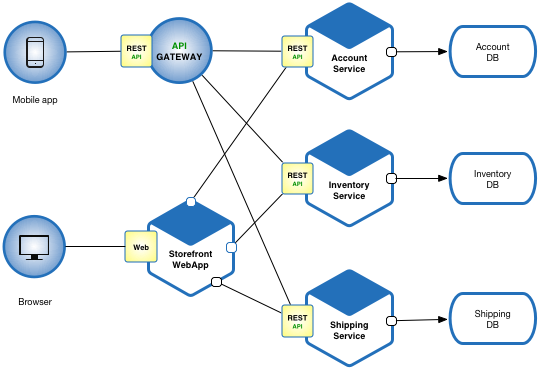
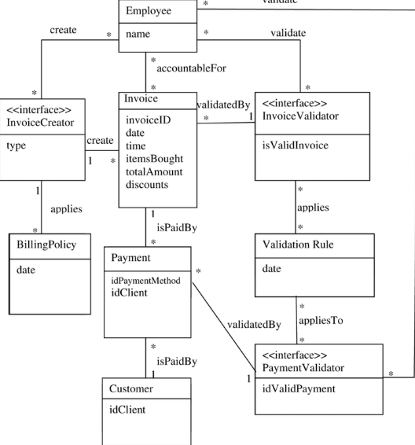
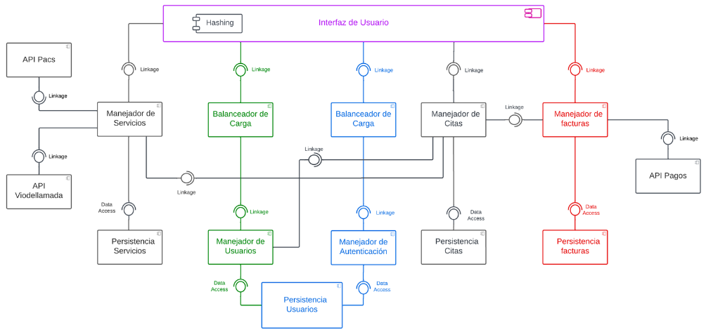
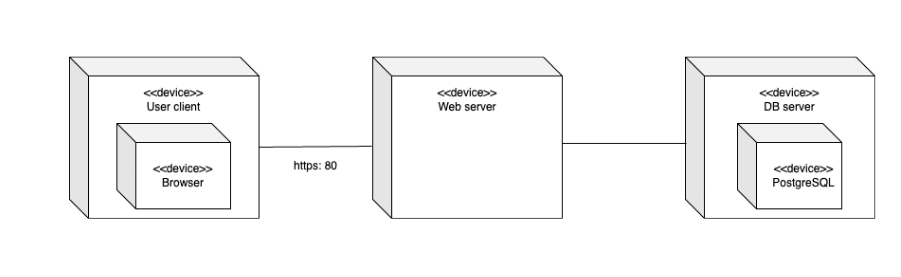
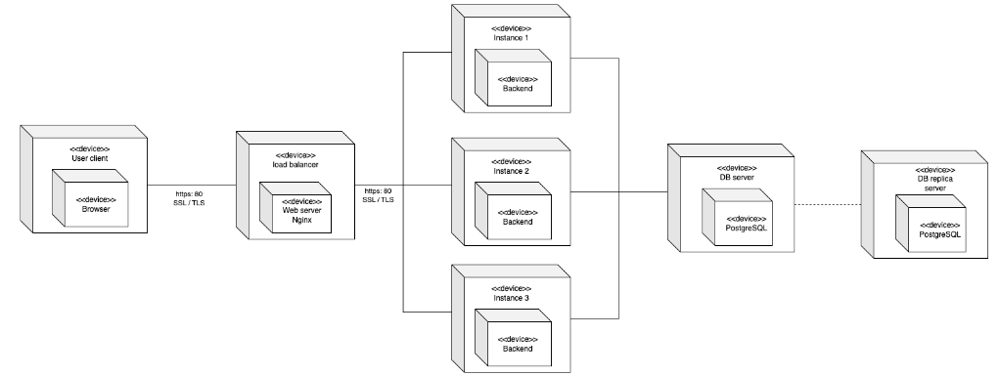
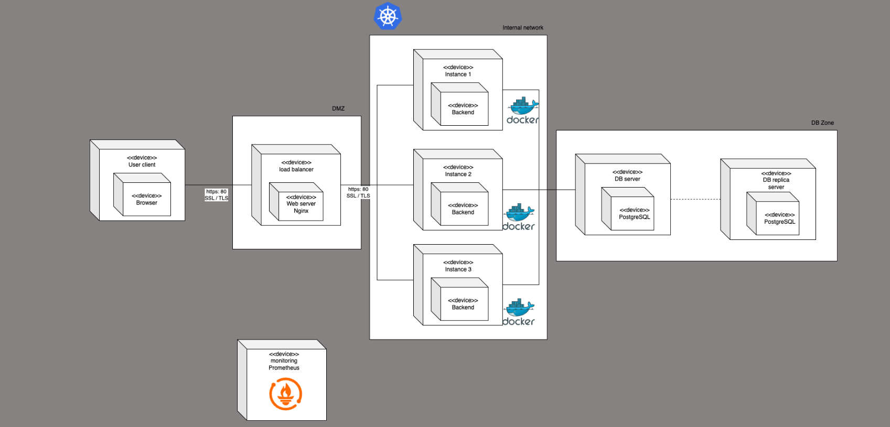

## Preguntas de referencia

### Nodo ivestigador

Preguntas para la tool LLM

1. What is ADD 3.0?
1. What is a proxy used for?
1. In what case is the Factory pattern used?

preguntas para la tool LLMWithImages

1. What pattern is shown in the image? (**Diagram**)

preguntas para la tool Local_RAG

1. ¿Para que se utiliza la tactica de desempeño Dividir y paralelizar?
1. ¿Para que se utiliza la tactica de disponibilidad de Redundancia Activa?

### Nodo Creador

1. Give me a class diagram that represents the Factory pattern.
1. Give me a sequence diagram that represents an interaction with a system using the Factory pattern.
1. Give me a deployment diagram for an IoT system using the pub-sub pattern.

### Nodo Evaluador

Preguntas para las tools theory_tool, viability_tool, needs_tool

1. We designed a system using the microservices architecture pattern to support around 5,000 concurrent users for a university’s student services portal. Recently, the number of users has doubled, and we are experiencing issues with latency and service coordination. As a solution, we are considering implementing an event-driven architecture using Kafka to decouple services and improve scalability. Is this architectural shift theoretically sound, feasible to implement under our current constraints, and does it align with the platform's core requirements?
1. Our platform currently relies on a layered monolithic architecture and is deployed on-premises. Due to organizational changes, we are now required to ensure 24/7 availability and provide services to multiple international branches. We are proposing to migrate to a cloud-native architecture using Kubernetes and adopt a hexagonal architecture to improve adaptability and maintainability. Is this proposal valid from a theoretical perspective, realistic given potential budget and skill limitations, and aligned with the long-term needs of the institution?

Preguntas para la tool analyze_tool

1. I have this component diagram (second image) that have an invoice management component (manejador de facturas), also i have the class diagram (first image) that explains that component. Analyze the implementation of the class diagram for the component that favors quality attributes such as performance and scalability. (**Class Diagram** and **Component Diagram**)

### Nodo ASR

1. We need a system that can handle 10,000 concurrent users using the invoice service to generate invoices, with response times under 200ms, but we have a limited budget and must use Technology Postgresql to save the data of each invoice. Any advice?
1. I have implemented this deploy diagram for the ASR before described, evaluate it. (**Diagram**)
1. Ok this is my new version of the diagram give me a feedback. (**Diagram**)
1. I implement some suggestions, this is my new diagram, evaluate it. (**Diagram**)
