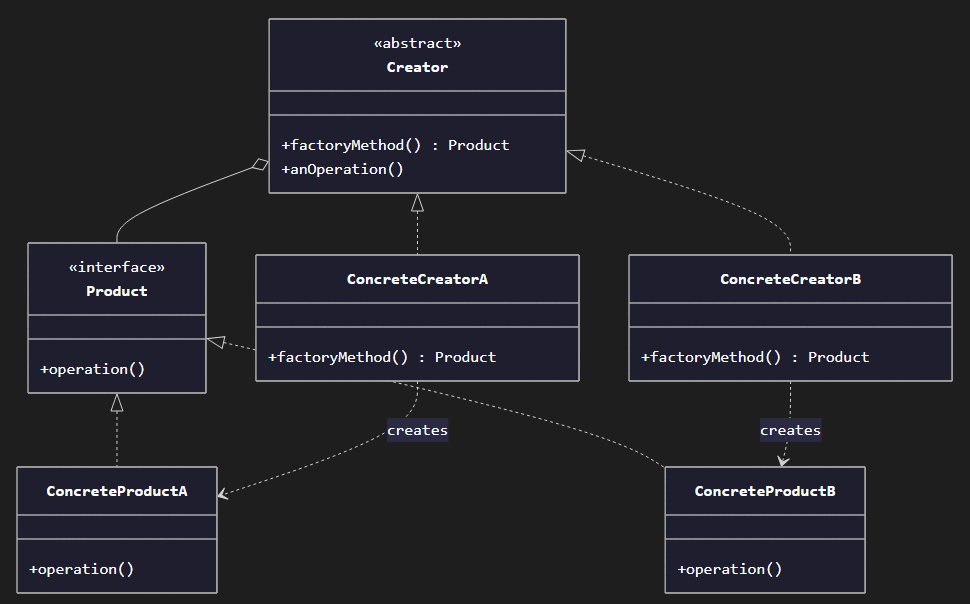
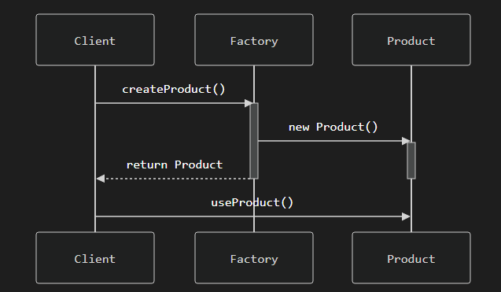
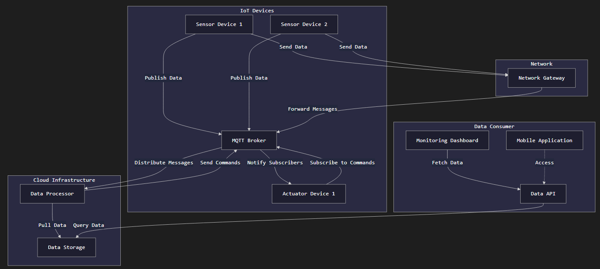

## Preguntas de referencia

### Nodo ivestigador

Preguntas para la tool LLM

1. What is ADD 3.0?

Attribute Driven Design (ADD) 3.0 is a systematic approach to software architecture that emphasizes designing systems based on quality attributes such as performance, security, usability, and modifiability. This method guides architects in making structured design decisions to align with the desired software properties and functionalities, ensuring that the architecture effectively meets its requirements. The primary objective of ADD 3.0 is to focus on and prioritize these quality attributes, allowing for a comprehensive understanding of how they can be optimized within the design process.

ADD 3.0 is particularly useful in a variety of contexts. For instance, it is well-suited for designing complex software systems where balancing multiple quality attributes is critical. It is also beneficial in projects that follow iterative or agile development processes, as it helps teams continuously address evolving requirements. Additionally, ADD 3.0 is ideal for component-based architecture designs, enhancing clarity and focus on interactions between components. In large team-based projects, ADD 3.0 offers a common framework and language that promotes alignment and consistency across different parts of the system.

The approach also proves valuable in evolutionary design, helping maintain and scale systems effectively over time without compromising existing quality attributes. It assists in addressing cross-functional requirements where non-functional attributes like security and performance are as critical as the functional requirements. Moreover, ADD 3.0 aids in dependency management within software systems, ensuring that architectural decisions positively impact the desired software attributes and overall system quality, thereby fostering a robust and adaptable architecture.

1. What is a proxy used for?

A proxy, within the realm of computer networks, acts as an intermediary server that separates end users from the websites they visit. One of the primary purposes of a proxy is to enhance security and privacy. By obscuring a user's IP address, proxies make it more difficult for others to track browsing habits, thereby providing greater anonymity on the internet. This feature is particularly valuable for individuals who wish to protect their privacy while browsing online.

Additionally, proxies are employed for access control, allowing organizations to block access to certain websites. This is particularly useful in corporate or educational networks where it is necessary to enforce policies and restrict access to non-work-related sites. Proxies are thus an essential tool for maintaining productivity and ensuring adherence to network usage policies.

Proxies also play a significant role in optimizing network performance. Through load balancing, they help distribute incoming traffic among several servers, mitigating the risk of overloading any single server. This results in improved performance and availability. Moreover, by caching frequently accessed content, proxies reduce bandwidth usage and speed up access times for repetitive requests.

Apart from these technical functions, proxies serve as a tool for bypassing geographic restrictions, enabling users to access content that is otherwise unavailable in their location. Additionally, proxies can filter and compress data, filtering out unwanted content such as ads or compressing data to enhance loading times and reduce bandwidth consumption. This multifaceted utility makes proxies integral to a variety of applications in both network management and software architecture.

1. In what case is the Factory pattern used?

The Factory pattern is a creational design pattern primarily used to provide an interface for creating objects within a superclass while allowing subclasses to modify the type of objects being created. This pattern delegates the responsibility of object instantiation to an interface, enabling clients to adhere to a consistent object creation pattern without delving into the specifics of the instantiation process. By abstracting object creation, the Factory pattern enhances system modularity and ensures that client code remains unaffected by changes in the creation process.

Several scenarios highlight the use and benefits of the Factory pattern. One notable advantage is the decoupling of object creation, crucial in large applications where the logic can become complex and scattered, thus enhancing modularity and allowing for easy creation code modifications without affecting the client code. Additionally, the pattern supports extensibility, paving the way for new types to be easily introduced without altering existing components. This complies with the open-closed principle, whereby systems remain open for extension but closed for modification. Furthermore, the Factory pattern is instrumental in managing complex object creation logic involving intricate conditional logic or necessary initialization steps, encapsulating and simplifying such processes for reusability and manageability.

The Factory pattern also provides a unified interface for clients, crucial in scenarios where different systems need to create products with varying methods, thus promoting consistency through a standard API for object creation. It proves beneficial in developing reusable libraries or frameworks, where end-users or developers can extend functionalities based on individual needs, offering flexibility while maintaining a robust default configuration. Additionally, the pattern effectively manages the lifecycle and state of objects, optimizing resource utilization through controlling and caching mechanisms. Lastly, by abstracting unnecessary details, the Factory pattern simplifies client code maintenance across multiple implementations without exposing the complex underlying product class structures.

Typical examples employing the Factory pattern include logistics systems, where transport objects such as ships and trucks are created; game engines, which instantiate game entities like players or enemies; web frameworks, generating various HTTP request objects; and graphical user interfaces (GUIs), instantiating diverse button types or UI components based on user preferences or configurations. These use cases demonstrate the pattern's versatility and its pivotal role in enhancing system flexibility, scalability, and maintainability across different software domains.

preguntas para la tool LLMWithImages

1. What pattern is shown in the image? (**Diagram**)

The image in question illustrates a **RESTful API-based distributed system** architecture. The system is structured to include several key components. Firstly, there are client applications, specifically a mobile app and a web browser, that interact with the API. There is also an API gateway that acts as the entry point for the API, managing the routing of requests to the suitable services. The system is organized into several services: an Account service that manages user accounts, an Inventory service overseeing product inventory, and a Shipping service responsible for distributing products to customers. Furthermore, databases such as Account DB, Inventory DB, and Shipping DB are incorporated to store information pertinent to user accounts, product inventory, and shipping details, respectively.

The architectural design adheres to several principles aimed at enhancing the system's performance and reliability. Primarily, it follows a **Service-oriented Architecture (SOA)** approach, which involves segregating the system into distinct services, each assigned to a particular task. This separation increases maintainability and scalability. The system also embraces the principle of **loose coupling**, ensuring that services remain independent, thus fostering flexibility and simplifying potential modifications. Moreover, the system is inherently **scalable**, designed to accommodate a high volume of requests via a distributed framework and the incorporation of load balancing techniques.

Additionally, the architecture leverages several design patterns to improve system structure and function. The **Model-View-Controller (MVC)** pattern is employed to disconnect the user interface from business logic, simplifying maintenance and testing processes. The **Repository pattern** abstracts the complexities of database access, introducing a layer of flexibility, while the **Factory pattern** supports object creation in a manner that enhances system adaptability and testability. Overall, the architecture is devised with strategies to ensure it is easy to maintain, scalable, and adaptable to changes, making it well-equipped to support the requirements of distributed systems.

preguntas para la tool Local_RAG

1. ¿Para que se utiliza la tactica de desempeño Dividir y paralelizar?

La táctica de desempeño "Dividir y Paralelizar" se utiliza en la arquitectura de software para optimizar el procesamiento de tareas complejas y mejorar el rendimiento del sistema. Esta técnica ayuda a un sistema a manejar eficazmente un incremento en la carga de trabajo y a reducir el tiempo de respuesta. Al dividir y paralelizar, se busca que el sistema pueda gestionar más eficientemente la demanda de recursos y mejorar su capacidad de respuesta bajo diferentes volúmenes de carga.

La aplicación de esta táctica implica descomponer una tarea grande o compleja en partes más pequeñas y manejables, que pueden ser procesadas simultáneamente. Esto permite utilizar múltiples recursos al mismo tiempo, completando la tarea más rápidamente que si se hiciera de manera secuencial. De esta manera, no solo se mejora el tiempo de respuesta del sistema, sino que también se optimiza el uso de los recursos, logrando un sistema más eficiente en términos de escalabilidad y rendimiento, especialmente frente a cargas de trabajo variables.

Finalmente, es importante destacar que un objetivo del arquitecto de software al emplear tácticas de desempeño como "Dividir y Paralelizar" es poder predecir con precisión cómo se comportará el sistema ante cambios en la carga de trabajo. Esto implica no solo mejorar el procesamiento repetitivo, sino también escalar los componentes correctos del software, ya que gran parte del trabajo se realiza en una pequeña proporción de estos componentes. Esto asegura que el sistema pueda adaptarse a cambios en el volumen de trabajo sin comprometer su eficiencia o su capacidad de respuesta.

1. ¿Para que se utiliza la tactica de disponibilidad de Redundancia Activa?

La táctica de Disponibilidad de Redundancia Activa en arquitectura de software se utiliza principalmente para asegurar la continuidad del servicio ante posibles fallos en el sistema. Esta estrategia implica la duplicación o multiplicación de componentes críticos, lo que permite que, si uno de los componentes falla, otros puedan continuar prestando sus funciones sin una interrupción significativa. Este enfoque es vital para mantener la operatividad de sistemas donde la disponibilidad constante es crítica, reduciendo riesgos tanto en términos de servicio interrumpido como de posibles impactos adversos para los usuarios o la operación.

La redundancia activa se aplica en diversos escenarios críticos, cada uno con requerimientos específicos de disponibilidad. En sistemas de servicios financieros, como los de bancos, donde las transacciones deben realizarse las 24 horas del día, esta táctica es fundamental para minimizar riesgos de errores o periodos de inaccesibilidad. En centros de datos, su implementación garantiza que, incluso ante fallos técnicos o desastres naturales, el acceso a datos críticos y su procesamiento continúe sin interrupción. Asimismo, es utilizada por empresas de telecomunicaciones para mantener operativas las redes de comunicación, incluso durante fallos en los nodos o líneas.

Finalmente, la redundancia activa es clave en el ámbito de aplicaciones de cloud computing y en instalaciones críticas. Servicios como Amazon Web Services o Google Cloud dependen de esta estrategia para ofrecer alta disponibilidad, replicando nodos de servicio que pueden asumir cargas en el caso de fallos. En infraestructuras esenciales como hospitales, plantas nucleares u operaciones de tráfico aéreo, la implementación de arquitecturas de redundancia activa es indispensable para prevenir cualquier interrupción en el servicio, donde una falla podría tener consecuencias graves para la seguridad y vida humana.

### Nodo Creador

1. Give me a class diagram that represents the Factory pattern.

The Factory design pattern is a creational pattern used in object-oriented programming to create instances of a specific class without having to specify the exact class of the object that will be created. This pattern involves defining an interface or an abstract class for creating the objects, allowing subclasses to alter the type of objects that will be created. In a class diagram, a typical representation includes a `Product` interface or an abstract class, with `ConcreteProductA` and `ConcreteProductB` as its concrete implementations. A `Creator` abstract class contains a `factoryMethod()` designed to return a `Product`, and `ConcreteCreatorA` and `ConcreteCreatorB` are classes that implement this method to instantiate `ConcreteProductA` or `ConcreteProductB`, respectively.

An essential part of the pattern is the decoupling of the object creation process from the client code. This decoupling increases the flexibility of the system, allowing it to be extended easily by adding new product types without modifying the existing code. The `Creator` abstract class defines default behavior and contains the factory method responsible for producing product instances. This setup ensures that object instantiation logic is centralized and can be extended by overriding the `factoryMethod` in concrete subclasses.

In summary, the Factory pattern enables the creation of different product objects through a common interface while hiding the instantiation logic from the client. This abstraction layer facilitates easier maintenance and scalability of the application by adhering to the Open/Closed principle, allowing the system to be open for extension but closed for modification.

1. Give me a sequence diagram that represents an interaction with a system using the Factory pattern.

Creating a sequence diagram for a system interaction using the Factory pattern involves understanding the key roles and interactions. The core participants in this pattern include the client, the factory, and the product objects that the factory creates. These participants work together to create and use objects without exposing the creation logic to the client, thus adhering to the principles of abstraction and encapsulation.

In a typical sequence diagram using the Factory pattern, the process starts with the client sending a request to the factory to create a product. The factory, acting as an intermediary, handles the instantiation process and creates a product object. This product object can be an interface or an abstract class that is implemented by concrete products. After creation, the product is returned to the client. Following this, the client can interact with the product using various methods specific to the product's functionality.

The sequence diagram provides a simplified overview of how these interactions occur within systems that utilize the Factory pattern. While the example focuses on a basic workflow, real-world scenarios may include additional complexities, such as handling multiple product types or integrating additional components to manage product lifecycle events. The Factory pattern, through its abstraction capabilities, enables systems to achieve higher levels of flexibility and scalability.

1. Give me a deployment diagram for an IoT system using the pub-sub pattern.

Creating a deployment diagram for an IoT system using the Pub-Sub pattern involves outlining how different system components interact within the architecture, with a focus on distributed communication. The primary elements of this architecture include IoT devices, cloud infrastructure, data consumers, and the network, each playing a specific role in the data flow and management process.

The IoT devices segment consists of sensors and actuators. Sensors are responsible for publishing data, such as measurements or environmental conditions, to an MQTT broker using the publish-subscribe pattern. Actuators, in turn, subscribe to command messages that dictate their operations. This interaction allows for a seamless flow of information from the physical world through the network to processing units.

The cloud infrastructure serves as the backbone of the communication system. At its core is the MQTT broker, which manages the distribution of messages between publishers (sensors) and subscribers (actuators). The Data Processor component within the cloud infrastructure retrieves data from the broker for processing and may store it in a central Data Storage facility. It also has the capability to send commands back to actuators, closing the loop of interaction between devices and the central processing unit.

Data consumers such as monitoring dashboards and mobile applications provide end-user access to the IoT system. These consumers interact with a Data API to fetch or query data from the storage, enabling users to visualize and manage the data. This layer is essential for translating raw sensor data into actionable insights for users.

Finally, the network component is represented by the Network Gateway, which manages connectivity and the forwarding of messages from IoT devices to the cloud infrastructure. The gateway ensures that data transmitted across the network is securely handled and efficiently routed to the appropriate components within the system. This segment guarantees that communication remains robust and uninterrupted, facilitating the overall operation of the IoT system using the Pub-Sub pattern.

### Nodo Evaluador

Preguntas para las tools theory_tool, viability_tool, needs_tool

1. We designed a system using the microservices architecture pattern to support around 5,000 concurrent users for a university’s student services portal. Recently, the number of users has doubled, and we are experiencing issues with latency and service coordination. As a solution, we are considering implementing an event-driven architecture using Kafka to decouple services and improve scalability. Is this architectural shift theoretically sound, feasible to implement under our current constraints, and does it align with the platform's core requirements?

Implementing an event-driven architecture using Apache Kafka is a theoretically sound approach to address scalability, latency, and service coordination challenges in a microservices environment. Kafka allows services to communicate asynchronously, effectively decoupling them and facilitating scalability as the system grows. This approach aligns well with your current challenges, as it can smoothly manage the increased load by leveraging Kafka’s partitioning model and stateless processing across distributed servers. A careful evaluation of your infrastructure's capacity and an assessment of your microservices' ability to be modified for this new architecture are crucial steps.

The feasibility of transitioning to Kafka involves multiple considerations. Your infrastructure must support the deployment and operation of Kafka clusters, which requires adequate data storage, network capacity, and reliable message delivery. Modifications to the microservices architecture are necessary to incorporate Kafka producers and consumers. Kafka’s replication and partitioning features will enhance availability and scalability, but this involves configuring brokers, topics, and ensuring that message delivery configurations are set correctly. Make sure to evaluate the current system for bottlenecks and refactor it to manage increased event-driven communication effectively.

Service coordination and latency issues can be significantly reduced with Kafka, as services can process messages asynchronously and independently. It is important to design your event streams to allow for these independent operations while ensuring that each service can manage its outputs and interactions efficiently. Consider implementing robust monitoring and management tools such as Prometheus and Grafana for performance observation and operational insights. Furthermore, an incremental rollout of services using Kafka will help manage the transition smoothly, starting with non-critical components. Proper stress testing and integration testing are essential to validate the system's capacity to handle the anticipated user load, ensuring that the architecture remains sound, feasible, and aligned with the platform’s core requirements.

1. Our platform currently relies on a layered monolithic architecture and is deployed on-premises. Due to organizational changes, we are now required to ensure 24/7 availability and provide services to multiple international branches. We are proposing to migrate to a cloud-native architecture using Kubernetes and adopt a hexagonal architecture to improve adaptability and maintainability. Is this proposal valid from a theoretical perspective, realistic given potential budget and skill limitations, and aligned with the long-term needs of the institution?

The current proposal to migrate from a layered monolithic architecture to a cloud-native setup using Kubernetes and a hexagonal architecture model is theoretically sound. Cloud-native architectures, especially those employing microservices managed through Kubernetes, are noted for their scalability and flexibility, which are essential for ensuring 24/7 availability across multiple international branches. Furthermore, adopting a hexagonal architecture enhances adaptability and maintainability by promoting separation of concerns and facilitating easier integration with different systems. This approach ensures that your architecture can evolve over time and accommodate new requirements without significant redesigns.

However, there are practical considerations to address, such as budget and skill constraints. Migrating to a cloud-native environment requires significant investment in terms of both infrastructure and personnel training. The learning curve associated with Kubernetes and microservice architecture can be steep, necessitating a dedicated team with the requisite skills or the hiring of new staff. Additionally, the initial investment in cloud infrastructure might be substantial, though it could be offset by the long-term benefits of scalability and low downtime.

Lastly, the proposal aligns well with the long-term needs of your organization if these needs include increased global reach, continuous availability, and the ability to swiftly adapt to technological changes. The modernization and cloud adoption will lay down a robust foundation for future growth and expansion. However, it is crucial to undertake a comprehensive cost-benefit analysis and a detailed skills assessment to ensure the proposal's feasibility before moving forward.

Preguntas para la tool analyze_tool

1. I have this component diagram (second image) that have an invoice management component (manejador de facturas), also i have the class diagram (first image) that explains that component. Analyze the implementation of the class diagram for the component that favors quality attributes such as performance and scalability. (**Class Diagram** and **Component Diagram**)

To analyze the implementation of the class diagram within the invoice management component (manejador de facturas), it's crucial to first establish how this class structure supports various quality attributes, particularly performance and scalability. Performance refers to how efficiently the system can process requests during peak loads, while scalability indicates the system's ability to handle increasing amounts of work effectively. In the context of the class diagram, performance can be enhanced through efficient data retrieval patterns, minimizing bottlenecks, and optimizing resource consumption. For scalability, incorporating design patterns that promote loose coupling and high cohesion can facilitate system expansion without significant refactoring.

The class diagram should be examined for architectural principles that support these attributes. Performance may be influenced by decisions such as caching frequently accessed data, utilizing asynchronous processing, and optimizing database interactions. It is also important to explore how the diagram supports distribution of workload to prevent overburdening a single component, which can be achieved by implementing load balancing mechanisms or microservices architecture. Scalability can be considered in terms of modularity within the class diagram, ensuring that components such as the invoice management system can operate independently and expand horizontally as demand increases.

The reference to image paths indicates the presence of two diagrams that are key to this analysis: the component diagram and the class diagram. While image details are not directly available in text form for review here, their strategic designs should align with best practices like separation of concerns and use of interfaces or inheritance to support performance and scalability. The component diagram provides a broad overview of system interactions, while the class diagram gives a detailed view of the invoice management logic, both of which should collaboratively ensure quality attributes are maintained.

### Nodo ASR

1. We need a system that can handle 10,000 concurrent users using the invoice service to generate invoices, with response times under 200ms, but we have a limited budget and must use Technology Postgresql to save the data of each invoice. Any advice?

Handling 10,000 concurrent users for generating invoices with response times under 200ms poses significant challenges, especially given the constraint of a limited budget. Scalability and performance optimization should be at the forefront of your system architecture. Consider employing a distributed system architecture that can balance the load across multiple servers. This could involve using load balancers to manage incoming requests efficiently. Additionally, implementing a caching mechanism (such as Redis or Memcached) can help reduce latency and improve response times by storing frequently accessed data, thus reducing direct interaction with the database.

Given the requirement to use PostgreSQL for storing invoice data, it's crucial to optimize the database for high performance. Ensure that your database schema is well-designed, with indexes on columns that are frequently queried to speed up data retrieval operations. Leveraging PostgreSQL's built-in features like connection pooling can help manage a large number of database connections efficiently. It's also possible to use partitioning techniques to enhance query performance by splitting large tables into smaller, more manageable pieces.

Lastly, since budget constraints are mentioned, it's important to select cost-effective cloud solutions or hosting services that offer scalability and performance optimization within your financial limits. Open-source tools and technologies can be leveraged to reduce costs while maintaining the effectiveness and reliability of the system. Monitoring and performance analytics tools should be implemented to continuously assess and optimize the system's performance, ensuring that it meets the specified response time and user concurrency requirements.

1. I have implemented this deploy diagram for the ASR before described, evaluate it. (**Diagram**)

The deployment diagram for the ASR system has several commendable aspects worth noting. Firstly, it demonstrates **clarity in its layered architecture**, which aids in separating concerns and managing complexity. The clear separation of each layer's purpose helps in making the system more understandable. The use of distinct color coding throughout the diagram enhances readability and allows for quick identification of individual components. Furthermore, **scalability considerations** are evident in the architecture as it supports horizontal scaling of component services and includes load balancers. This suggests an understanding of efficient traffic distribution, preventing the overloading of any single node. Additionally, the architecture shows a significant emphasis on **security measures**, with implicitly defined boundaries like firewalls and DMZs. Lastly, the use of APIs for integration highlights an understanding of standardized communication protocols, which is crucial for smooth system interactions.

Despite these strengths, there are areas where the deployment diagram could improve. One major shortcoming is the **lack of detail in data flow**; the diagram does not clearly delineate pathways or describe the flow of data between components, which is essential for understanding system interactions. Another issue is the **insufficient indication of redundancy**; while scalability is considered, redundancy for high availability or failover mechanisms is not visibly apparent, which could be a potential pitfall. Moreover, some components seem **overloaded**, serving multiple functions that might lead to inefficiencies or bottlenecks. This clustering contradicts the single responsibility principle. **Resource management** is also an area of concern, as the diagram does not present any strategy for managing resources or state, both of which are crucial for scalability and consistent performance.

To enhance the deployment diagram, several adjustments can be made. **Improving data flow clarity** should be a priority; incorporating directional arrows and labels could better illustrate the flow of data between components. Introducing **redundancy and backup strategies** is also vital for ensuring seamless operation during failures, thus boosting the system’s resilience. Moreover, it is advisable to **optimize component design** by decomposing overloaded components into smaller, distinct microservices with well-defined responsibilities in line with the microservices architectural pattern. Implementing **resource and state management solutions**, such as caching systems, can greatly improve resource use efficiency. Security protocols could be detailed further, including clear specifications for authentication, authorization, and data encryption to reinforce system integrity. Finally, ensuring compliance with recognized patterns like the **N-tier architecture** will aid in achieving better organization and encapsulation.

Feel free to reach out for further guidance or specific insights on any particular aspect of the architecture.

1. Ok this is my new version of the diagram give me a feedback. (**Diagram**)

When evaluating your architecture diagram, several positive aspects were noted. The diagram successfully demonstrates a clear separation of layers, which is essential for maintaining modularity and a structured organization of components. Key elements like UI, backend, and database are effectively represented, reflecting an understanding of basic system architecture. Additionally, the inclusion of scalability features like load balancers indicates an anticipation for the system's growth and expansion. Security aspects are well-addressed with the integration of firewalls and authentication services, ensuring data protection. Finally, the diagram showcases clear pathways for communication with external APIs or services, illustrating the system’s ability to integrate with third-party platforms.

However, there are several areas that require improvement. Some flows and connections in the diagram are not sufficiently labeled, which could result in confusion regarding component interactions. The absence of contextual details such as user roles and the direction of data flow complicates the comprehensive understanding of system operations. Furthermore, the diagram includes some elements that appear redundant, adding unnecessary complexity. There is also a lack of visible mechanisms for error handling or fault tolerance, which are critical for system reliability. Some namespaces are ambiguous, which may affect ownership clarity among components. Additionally, non-functional requirements such as performance benchmarks are not visibly accounted for, which are important for system design and evaluation.

To enhance the quality and clarity of the diagram, several suggestions are proposed. First, improve labeling and annotations to clearly depict data flows and functional boundaries. Consider integrating components or paths to illustrate how the architecture handles errors and recovers from faults. Analyzing the diagram for redundant elements could streamline the design and optimize its performance. Expanding the diagram to include non-functional aspects like performance, scalability, and maintainability would further strengthen its robustness. Incorporating contextual information such as user roles and environmental factors can provide better comprehension of interactions and system operation. Lastly, ensure that namespaces are clearly defined to avoid any ambiguity regarding component ownership and accountability.

By addressing these points and implementing the suggestions, the overall quality, robustness, and comprehensibility of your architecture diagram can be significantly improved, making it a more useful and informative tool for stakeholders.

1. I implement some suggestions, this is my new diagram, evaluate it. (**Diagram**)

The evaluation of your new architecture diagram involves examining its theoretical correctness, feasibility, and alignment with your specified requirements. 

### Theoretical Correctness
**Positive Aspects:** The architecture benefits from a modular structure that effectively separates concerns through distinct modules, aiding maintainability and scalability. The layered approach ensures a clear flow of data and distribution of responsibilities, from the presentation layer through to data handling. By utilizing APIs for integration, the diagram supports flexibility, facilitating easy updates and replacements of modules. A centralized database abstraction layer promotes secure and consistent data handling. Components that are independently scalable are designed to accommodate growth, while the inclusion of authentication and authorization features highlights a focus on security.

**Negative Aspects:** However, the diagram lacks explicit data flow directions and operation sequences, which are crucial for understanding interaction patterns. There is also a lack of detail about redundancy protocols or failsafe mechanisms, which are important for reliability. Without specified technologies and protocols for API interactions, implementation may face obstacles. The overlapping user interaction components could lead to tight coupling, and the absence of a microservices vision might prevent benefits related to independent deployment. Some components have missing descriptions, potentially causing confusion about their functionalities.

**Suggestions for Improvement:** It is recommended to incorporate detailed data flows, specify communication protocols, clarify user interactions, and label all components comprehensively. Additionally, moving towards a microservices architecture might enhance deployment flexibility.

### Feasibility
**Positive Aspects:** The architecture showcases an innovative approach by integrating existing technologies in a novel manner. Its modular components support scalability, with potential for future adaptations. Cloud-based platforms are leveraged for cost efficiency, while the separation of components increases robustness by isolating faults. Emphasis on user-centric design aims to enhance user engagement and experience.

**Negative Aspects:** On the downside, integrating numerous technologies could lead to technical complexity and interoperability challenges, complicating maintenance. Security risks related to data transmission and storage are not fully addressed, while hidden costs might emerge from maintaining systems or subscription services, affecting long-term financial feasibility. The implementation requires specialized skills, raising labor costs and necessitating extensive training. The complexity might also demand more computing resources than anticipated.

**Suggestions:** Simplifying integration and strengthening security measures can mitigate several concerns. A comprehensive cost-benefit analysis, development of training programs, regular stress testing, and a user feedback loop can significantly enhance the feasibility and usability of the system.

### Requirement Alignment
**Positive Aspects:** The system architecture aligns well with scalability needs, employing load balancers and redundant servers to handle increased demand. Performance requirements are met through optimization techniques like caching and asynchronous data processing. Security is enhanced via firewalls and encryption, ensuring data protection. Microservices contribute to consistent user interaction experiences, and the flexible modular design can accommodate future scalability requirements.

**Negative Aspects:** There is a lack of clear strategies for cost optimization, which is vital if budget constraints are prioritized. The architecture does not explicitly define data management strategies, important for meeting analytic needs. Similarly, the lack of detailed timelines and resources raises questions about the feasibility within a given timeframe, while the absence of evident customization options may limit the system's adaptability to user-specific needs. There’s also an unclear focus on integrating third-party solutions or legacy systems.

**Suggestions:** To improve alignment, incorporate a cost-benefit analysis with phased infrastructure expansion. Define clear data management approaches, establish a detailed deployment timeline, and highlight areas that allow for customization and easy integration with external systems. This will ensure the system meets both current and future user requirements effectively.